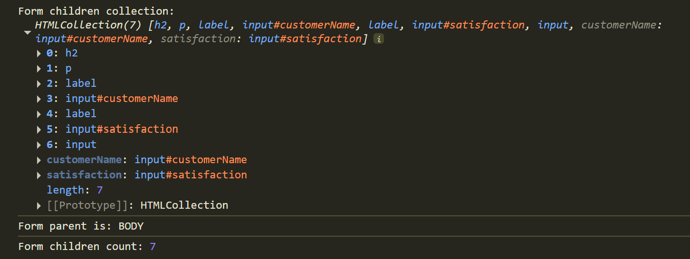
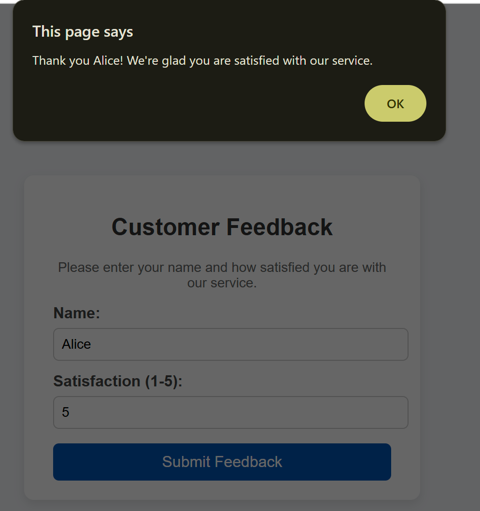

# Assignment: Business Feedback Form

In this exercise, you will practice working with DOM methods and event handling in JavaScript.  

You will complete the provided **`script.js`** and **`index.html`** file by following the **TODO comments**.  

## Learning Goals
- Select elements using **`querySelector`**
- Explore DOM hierarchy with **`parentElement`** and **`children`**
- Add event listeners with **`addEventListener`**
- Use **conditional operators (`? :`)** to build dynamic messages
- Debug values with **`console.log`**

## Instructions
1. Open `index.html` in your browser.  
2. Complete the missing parts in `index.html` and `script.js` where the `TODO` comments are written.  
3. Use the browser **console** to check your logs.  
4. When you submit the form, an **alert** should display a personalized message.  

## Expected Output Examples

### Console Logs

### Alert Messages
  
*Positive feedback of 4 or More*

  
*Negative feedback of less of 4*

